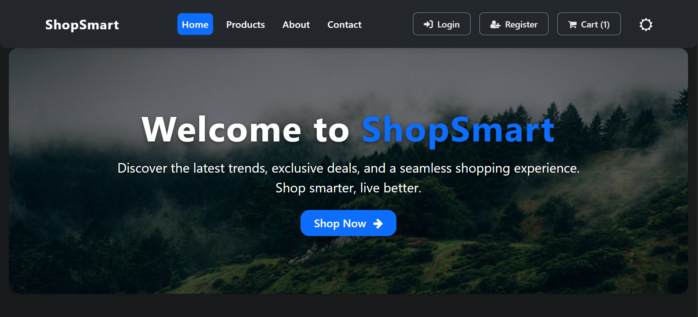

# ShopSmart

A Ecommerce Website made with React.js Framework.


## Demo

https://reactjs-ecommerce-app.vercel.app/

## Features

- Easy to integrate with Backend
- Fully Responsive


## Screenshots

<!-- Use forward slashes for cross-platform + GitHub rendering -->


<!-- Fallback HTML (optional): uncomment if you need to control size -->
<!--  -->


````markdown
# ShopSmart

React + Redux e‑commerce demo using the Fake Store API. Clean routes, a themed UI (dark/light), persistent cart, and demo auth using localStorage.

## Demo

Live preview (original): https://reactjs-ecommerce-app.vercel.app/

## Features

- Product listing, filtering, and detail page
- Add to cart, quantity update, order summary (with demo shipping)
- Persisted cart via localStorage
- Light/Dark theme with a toggle and CSS variables
- Client-side routing via React Router v6
- Demo auth (Register/Login/Profile) using localStorage

## Project structure

```
public/
  index.html
  assets/
    ShopSmart.PNG
    main.png.jpg
src/
  index.js               # App entry, routes, providers
  theme.css              # Theme tokens and UI polish
  components/            # Navbar, Footer, Product list, etc.
  pages/                 # Routed pages
  redux/                 # Store, actions, reducers
```

## Getting started

1) Clone the repo

```powershell
git clone https://github.com/rakesh-vajrapu/ShopSmart.git
cd ShopSmart
```

2) Install dependencies

```powershell
npm install
```

3) Run in development

```powershell
npm start
```

4) Build for production

```powershell
npm run build
```

## Scripts

- start: Launches the CRA dev server
- build: Production build to the build/ folder
- test: Run tests (if/when added)

## Tech stack

- React 18, React Router 6
- Redux Toolkit store configuration, classic reducer for cart
- Bootstrap 5 (from node_modules) and Font Awesome 4
- Fake Store API for product data

## Notes and troubleshooting

- Do not include external Bootstrap v4 CDN or jQuery; this project uses Bootstrap 5 from npm. The navbar toggler works via bootstrap.bundle.js already imported in `src/index.js`.
- Icons use Font Awesome v4 classes (e.g., `fa fa-shopping-cart`). We import its CSS from node_modules in `src/index.js`.
- Cart is saved in localStorage under the `cart` key; login status is saved as `isLoggedIn` and the current user under `currentUser`.
- Fake Store API is a public demo service; expect occasional latency.

## License

This project is provided for learning/demo purposes. See repository for license details.


````


